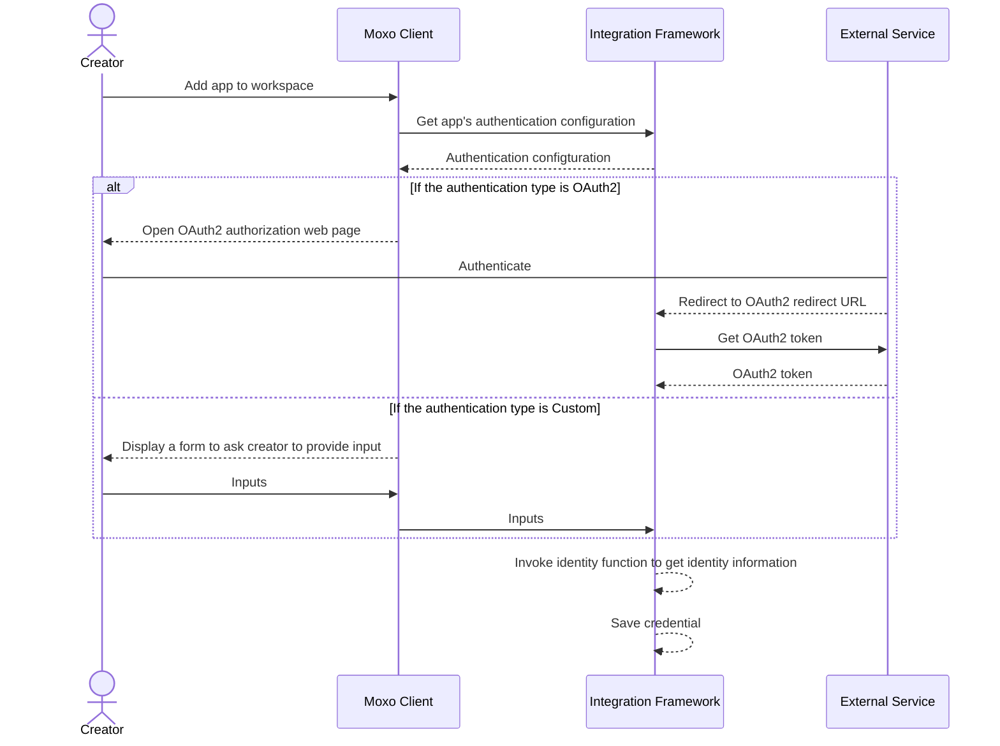
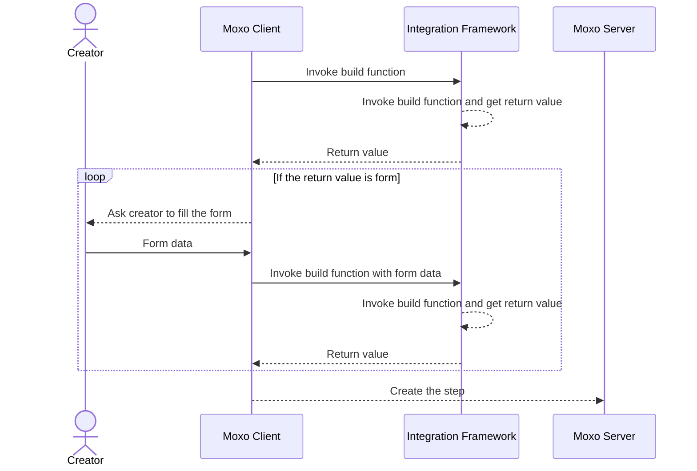
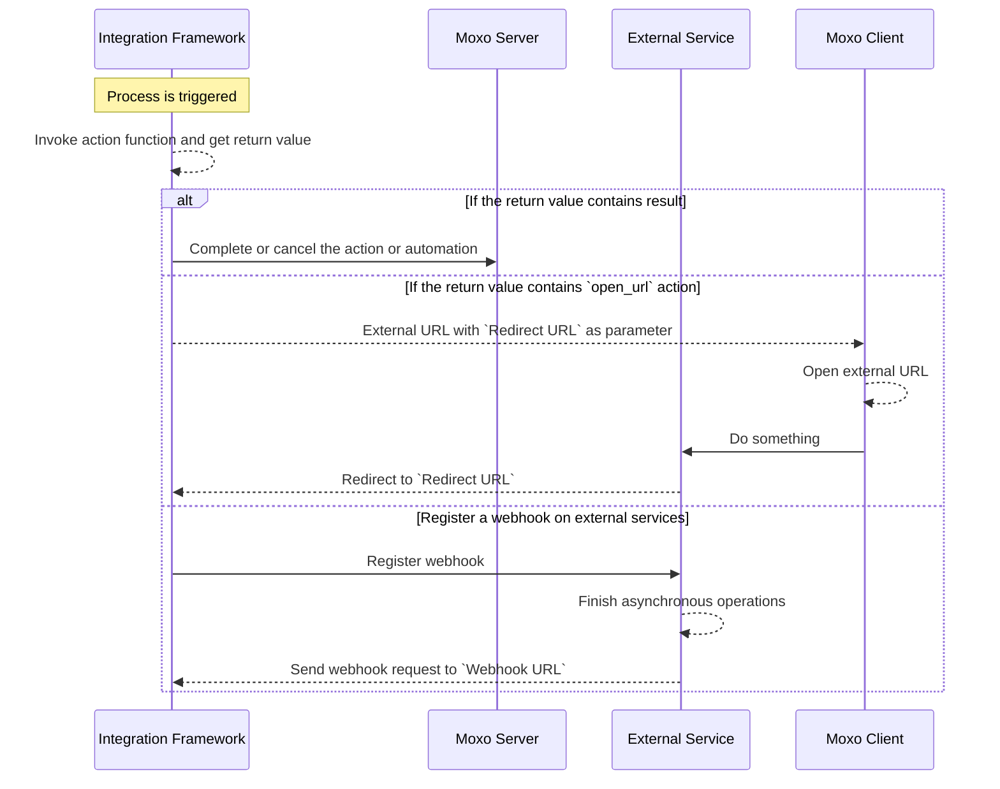
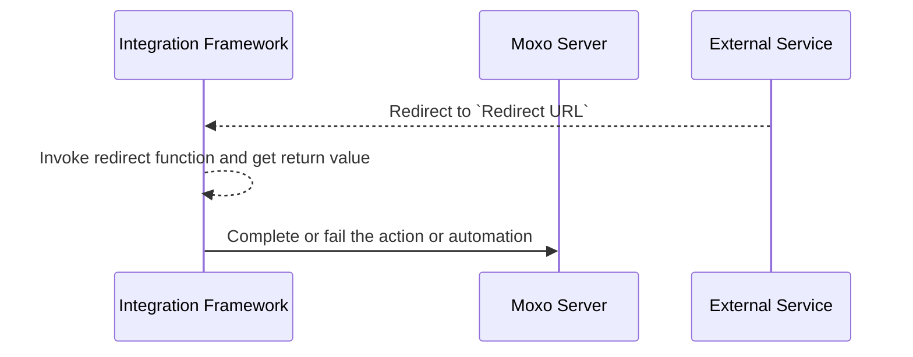
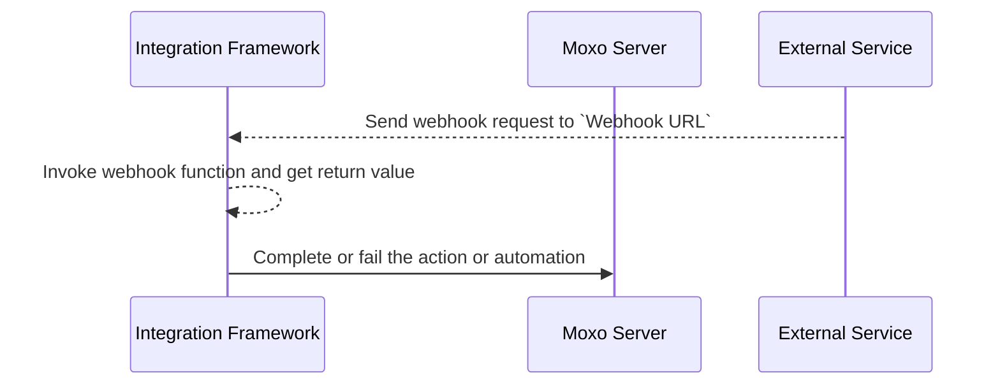

# Introduction

## Overview

Integration framework supports to define custom apps that can be used to add action, automation or await process to workspaces.

An app involves in two stages:

1. **Build time**: User adds a step to a workspace, by authentication and providing necessary inputs.
2. **Run time**: When the process is triggered. For action process, it is triggered by user clicking the action button. For other process, it is triggered when the step starts in the flow.

## Authentication

If the app needs to access external resources requiring authorization, it should be authenticated first. Now we supports two types of authentication, `OAuth2` and `Custom`, which can be configured in `Authorization` tab. The authorized credential will be passed to all app defined functions.

> Refer to [Authentication](./authentication.md) for more details.

After authentication, the app needs to provide an unique id and a display id for the credential. This can be configured in `Identity Function` tab. The identity function is a user defined script, integration framework will invoke it to get the identity information of the credential.

> Refer to [Identity Function](./identity-function.md) for more details.

## Provide inputs and create process

The logic of asking user to provide inputs can be configured in `Build Function` tab. Like identity function, the build function is also a user defined script. The script should return a JSON object, consisting one of following fields:

1. form
2. action
3. automation
4. await

If the `form` field is returned, the user will be asked to fill the form, and the build function will be invoked again with the form data. This will be repeated until one of the other field is returned, which will be used to create the process.

> Refer to [Build Function](./build-function.md) for more details.

## Handle process execution

This can be configured in `Action Function` tab. When the process is triggered, the action function will be invoked with authentication credential, inputs provided in build time, some context and two callback URLs:

1. Redirect URL
2. Webhook URL

There are three situations for the action function invocation:
1. Return the result, so that the process will be completed or failed.
2. Register the webhook url on external services, which should send a webhook request back after asynchronous operations finish.
3. For action process, return a `open_url` event, which asks Moxo client to open the url to the user, that url should take redirect url as a parameter, and should finally redirect to it after user finishes on that webpage.

> Refer to [Action Function](./action-function.md) for more details.

## Handle callback (optional)

### Handle Redirect

If the action function returns a `open_url` action, client will open the url, which should finally redirect to the redirect url. This step will be handled by script defined in `Redirect Function` tab.

> Refer to [Redirect Function](./redirect-function.md) for more details.

### Handle Webhook

If the action function registers a webhook, the external service should send a webhook request to the `Webhook URL` after asynchronous operations finish. This step will be handled by script defined in `Webhook Function` tab.

> Refer to [Webhook Function](./webhook-function.md) for more details.

